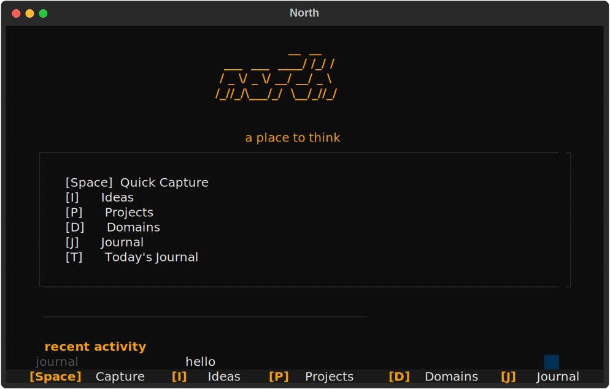
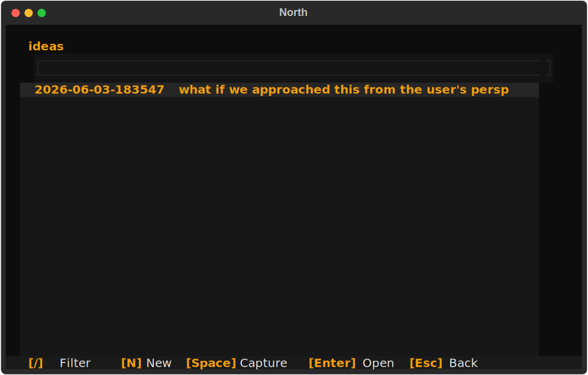

<div align="center">

```
                 __  __ 
  ___  ___  ____/ /_/ / 
 / _ \/ _ \/ __/ __/ _ \
/_//_/\___/_/  \__/_//_/
                        
```

# north

**a personal thinking workspace**

the cost of losing an idea is higher than the cost of storing an unorganized one.

<br>

[](https://python.org)
[](LICENSE)
[](https://docs.astral.sh/uv/)
[](https://textual.textualize.io)

<br>

**support this project →** [⭐ Star on GitHub](https://github.com/Dark-Knight499/northh)

</div>

---





---

## why

you have ideas all the time. in conversations, while reading, at 3am. you tell yourself you'll remember. you won't.

by the time you've picked the right folder, created the right file, figured out the right category — the thought is gone. north flips it: **capture first, organize later.**

ideas are raw captures. a thought, an observation, a question — no structure, no ceremony. just a timestamp and a markdown file.

projects are structured explorations. when an idea gains momentum, it gets its own directory, its own entries. titles become filenames. things take shape over time.

domains are long-term learning spaces. machine learning, systems, mathematics — areas you return to across months and years, building understanding without a finish line.

journal is personal reflection. daily entries append to a date-stamped file, creating a timeline you can look back on. not notes for something — just you talking to your future self.

the boundary between them is intentionally fuzzy. an idea can become a project. a project can reveal a domain. you don't need to get it right upfront — you just need to get it down.

everything is markdown in `~/.northh/`. no database. no lock-in. your editor, your tools, your data.

---

## 🚀 quick start

```bash
uv tool install northh
northh
```

### or with pip

```bash
pip install northh
northh
```

first run creates `~/.northh/` and opens the TUI. that's it.

> **Windows (PowerShell):** same commands. just make sure python 3.13+ is on your path.

---

## ⌨️ once you're in

| key | action |
|-----|--------|
| `Space` | capture whatever's on your mind |
| `I` | ideas |
| `P` | projects |
| `D` | domains |
| `J` | journal |
| `T` | today's journal entry |
| `N` | new entry (inside a browser) |
| `/` | filter by text |
| `Enter` / `O` | open in your editor |
| `Esc` | back |
| `?` | help |
| `Q` | quit |

### CLI quick capture

```bash
northh idea "a startup idea about X"
northh project my-project "some initial thoughts"
northh domain machine-learning "notes on transformers"
northh journal "today I learned..."
```

---

## 📂 structure

```
~/.northh/
├── ideas/        # timestamped.md — raw capture
├── projects/     # project-name/entry.md — structured work
├── domains/      # domain-name/entry.md — learning
└── journal/      # YYYY-MM-DD.md — daily reflection
```

```
northh/
├── src/
│   ├── functions/    # core logic, listing, editor
│   └── ui/
│       ├── app.py    # textual app shell + bindings
│       └── screens/  # home, browser, capture, new entry, help
├── docs/
│   └── philosophy.md # design vision
└── tests/            # pytest suite
```

---

## 🛠 development

```bash
git clone git@github.com:Dark-Knight499/northh.git
cd northh
uv sync
uv run python main.py
uv run pytest
```

---

<div align="center">

**MIT** — go build something.

<br>
<sub>
  if this project resonates, [star it on GitHub](https://github.com/Dark-Knight499/northh) ⭐
</sub>

</div>
