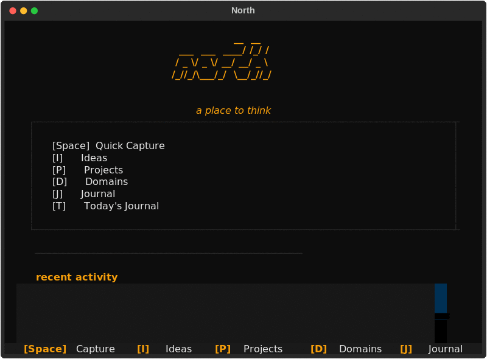

<div align="center">

```
                 __  __ 
  ___  ___  ____/ /_/ / 
 / _ \/ _ \/ __/ __/ _ \
/_//_/\___/_/  \__/_//_/
                        
```

# north

**a place to think**

ideas appear faster than you can organize them. north lets you catch them first and figure out the rest later.

<br>

[](https://python.org)
[](./LICENSE)
[](https://docs.astral.sh/uv/)
[](https://textual.textualize.io)

<br>

[Quick Start](#-quick-start) · [Usage](#-usage) · [Philosophy](docs/philosophy.md) · [Keybindings](#-keybindings)

</div>

---



---

## why

you have ideas all the time. in conversations, while reading, at 3am. you tell yourself you'll remember. you won't.

by the time you've picked the right folder, created the right file, figured out the right category — the thought is gone.

north flips it: **capture first, organize later.**

everything is markdown in `~/.northh/`. no database. no lock-in. your editor, your tools, your data.

---

## 📖 the four areas

north gives a user four containers. each serves a different kind of thinking.

**ideas** are raw captures. a thought, an observation, a question at 3am. no structure, no context needed. just timestamped and preserved. the digital equivalent of a napkin sketch.

**projects** are structured explorations. when an idea gains momentum, it becomes a project. each project gets its own directory, its own entries. entries can have titles — the title becomes the filename. this is for the user's active builds, the things they're shaping over time.

**domains** are long-term learning spaces. unlike projects, domains don't have a finish line. machine learning, systems design, mathematics — areas the user returns to repeatedly, building understanding over months and years.

**journal** is personal reflection. daily entries append to a date-stamped file, creating a timeline the user can look back on. not notes for a project, not a capture for later — just the user talking to their future self.

the boundary between them is intentionally fuzzy. an idea can become a project. a project can reveal a domain. the user doesn't need to get it right upfront — they just need to get it down.

---

## 🚀 Quick Start

### Linux / macOS

```bash
uv tool install northh
northh
```

### Windows (PowerShell)

```powershell
uv tool install northh
northh
```

### or with pip

```bash
pip install northh
northh
```

first time? it creates `~/.northh/` and drops you into the TUI. that's it.

---

## ⌨️ once you're in

| key | what it does |
|-----|-------------|
| `Space` | capture whatever's on your mind |
| `I` | ideas |
| `P` | projects |
| `D` | domains |
| `J` | journal |
| `T` | today's journal entry |
| `N` | new entry (inside a browser) |
| `/` | search/filter |
| `Enter` | open a file in your editor |
| `O` | open (alt to enter) |
| `Esc` | go back |
| `?` | help |
| `Q` | quit |

---

## 📂 what's inside

```
~/.northh/
├── ideas/        # timestamped.md — raw capture
├── projects/     # project-name/entry.md — structured work
├── domains/      # domain-name/entry.md — learning
└── journal/      # YYYY-MM-DD.md — daily reflection
```

the repo itself:

```
northh/
├── src/
│   ├── functions/        # core logic, listing, editor, ai
│   └── ui/
│       ├── app.py        # textual app shell
│       └── screens/      # home, browser, capture, new entry, conflict, help
├── tests/                # pytest — unit + integration + flow
└── docs/
    └── philosophy.md     # the full vision
```

---

## 🛠 building it

```bash
git clone git@github.com:Dark-Knight499/northh.git
cd northh
uv sync
uv run python main.py
uv run pytest
```

windows (powershell) is the same — just make sure python 3.13+ is on your path.

---

## 📜 license

MIT. go build something.

